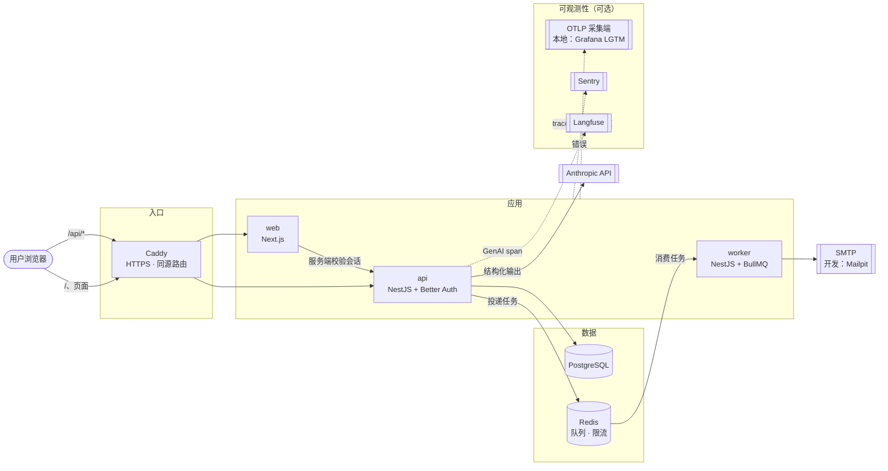
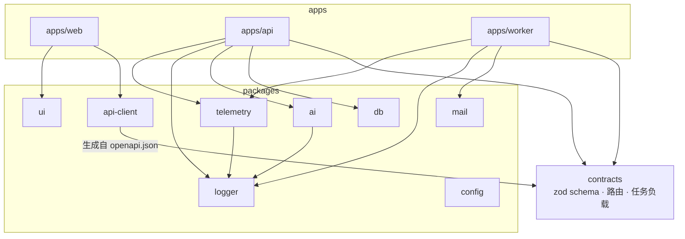
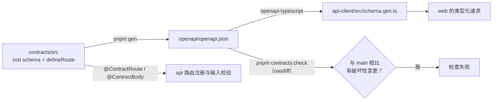
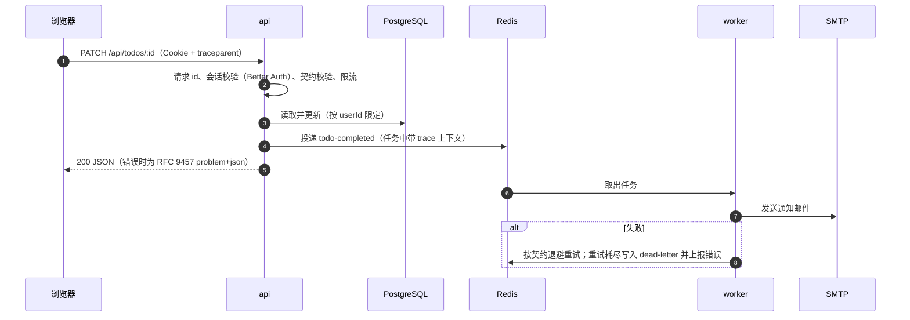
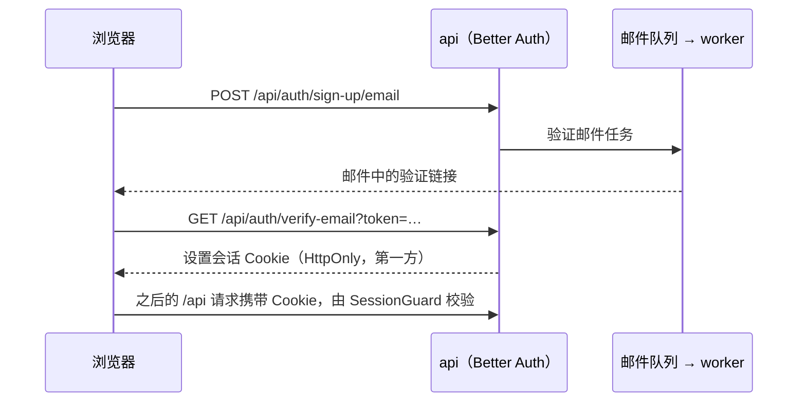
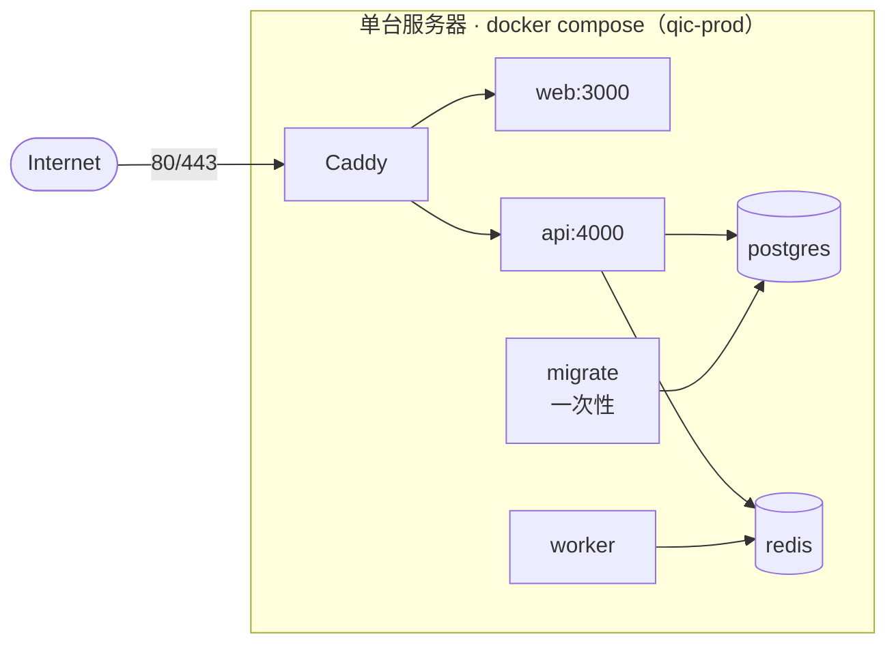
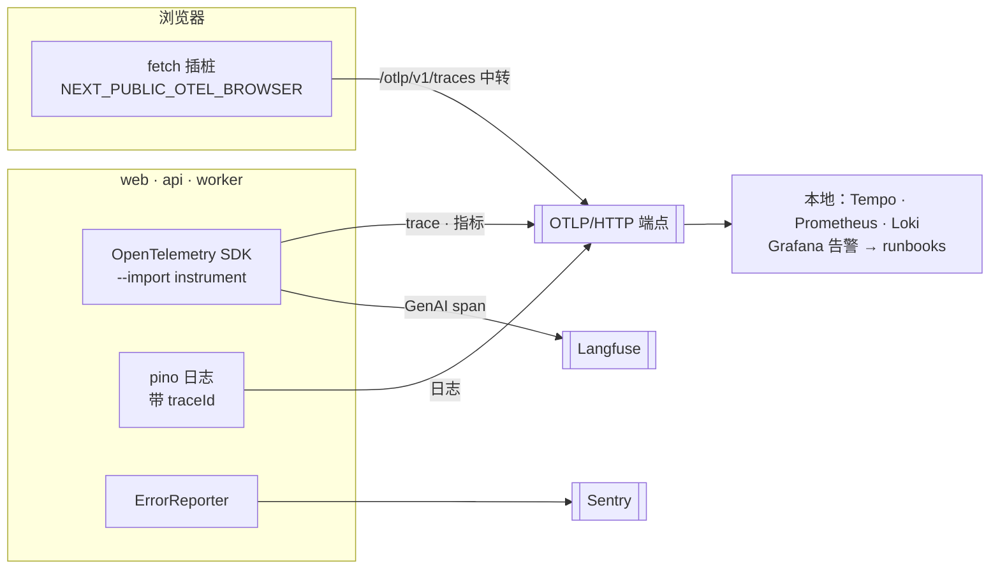

# 架构

本文用图说明 QiC 由哪些部分组成、数据如何流动、如何部署。为什么这样选型见 [ADR 0001](adr/0001-foundation.md)；各层代码写在哪里、怎么测试和调试，见 [developer-guide.md](developer-guide.md)。

> 当前仓库是工程基座。Todo（`/examples/todos`）只是演示完整链路的示例模块，不是产品功能；真实的领域模块照它的结构替换即可。

## 1. 系统上下文

- 浏览器只访问一个源：页面由 web 提供，`/api/*` 由 api 提供（开发时经 web 的 rewrites 代理，部署时由 Caddy 直接路由），因此鉴权 Cookie 始终是第一方的。
- api 不在请求中做慢操作：发邮件、通知等都投递到 Redis 队列，由 worker 处理。
- 虚线部分全部由环境变量开启，未配置时不产生任何开销。

## 2. 代码结构与依赖方向

规则由 dependency-cruiser 在 `pnpm check` 中强制：`packages/*` 不能依赖 `apps/*`，应用之间不直接 import，领域模块只能通过各自的 `index.ts` 被引用。

## 3. 契约与代码生成

契约是唯一的真相源：同一份 zod schema 同时决定 api 接受什么、返回什么，以及前端客户端的类型，二者不会漂移。

## 4. 一次请求的数据流

以“完成一个待办”为例（任何写接口 + 异步副作用都是同样的路径）：

开启链路追踪时，从浏览器的点击到 worker 发出邮件，所有步骤都在同一条 trace 中，日志也带同一个 `traceId`。

## 5. 鉴权

- 登录、注册、重置密码等接口由 Better Auth 处理，并与业务接口共用 Redis 限流器（见 `RATE_LIMIT_ENABLED`）。
- web 的 `proxy.ts` 只做“有无 Cookie”的乐观跳转；真正的会话校验在 api（`SessionGuard`）和 web 服务端（`getServerSession()`）。

## 6. 部署拓扑

- 只有 Caddy 暴露端口，其他服务都在内部网络中；容器以非 root、只读文件系统运行，带健康检查。
- 镜像按 digest 部署（`deploy.sh` 写入 `.env.images`），回滚即切回上一组 digest（`rollback.sh`）。
- 迁移在应用启动前由 `migrate` 服务执行，必须遵守 [expand/contract](runbooks/database-migrations.md)，保证新旧版本能同时运行。
- 详细步骤见 [infra/compose/README.md](../infra/compose/README.md)。

## 7. 可观测性

| 信号 | 来源 | 用途 |
|---|---|---|
| Trace | HTTP、Express/Nest、pg、ioredis、BullMQ、AI SDK、浏览器 fetch | 定位一次操作慢在哪、错在哪 |
| 指标 | HTTP RED、事件循环、V8 堆与 GC、连接池、队列积压、BullMQ、LLM token/成本/失败 | SLO 告警（`infra/obs/grafana/alerting/`） |
| 日志 | pino（JSON，带 `requestId`、`traceId`） | 与 trace 相互跳转 |
| 错误 | 5xx、重试耗尽的任务、web 渲染错误 | Sentry（按 release 聚合） |

告警与排查手册的对应关系见 [runbooks/README.md](runbooks/README.md)。
